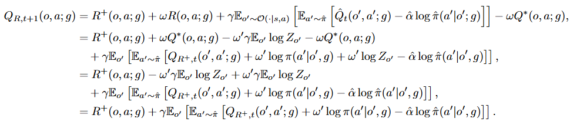
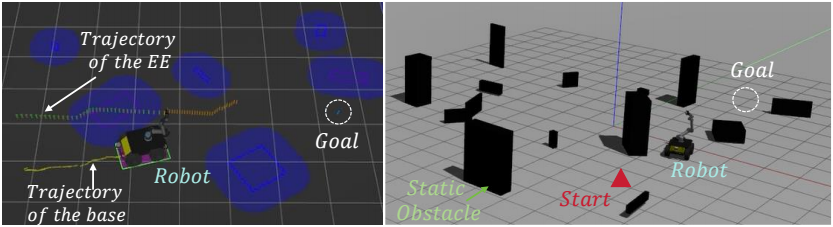
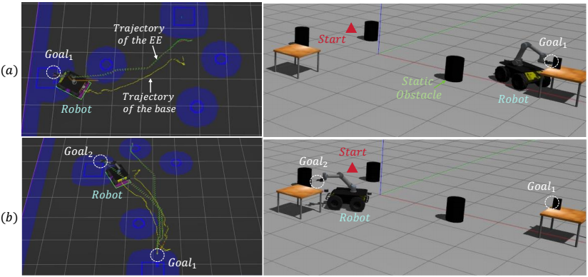
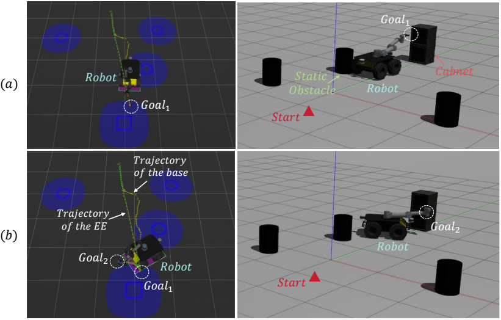
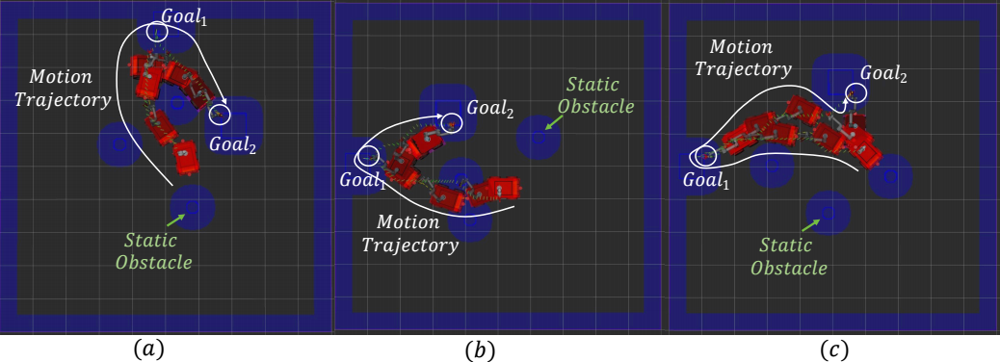
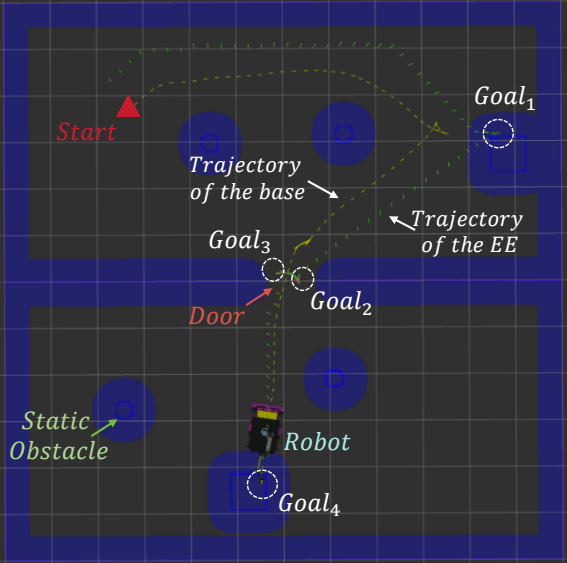
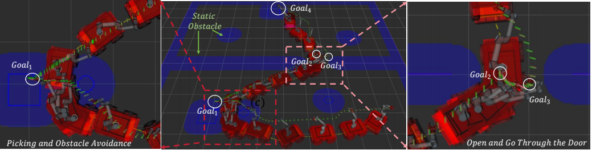

# LeGO-MM
LeGO-MM: Learning Navigation for Goal-Oriented Mobile Manipulation via Hierarchical Policy Distillation

## Derivation of Policy Evaluation (Eq. (6)) in SPD

In the SAC algorithm, the policy evaluation step aims to iteratively compute the soft Q-value of a policy $\hat{\pi}$, which relies on repeatedly applying a modified soft Bellman backup operator given by:

$$
\hat{Q}_{t+1}(o, a;g) = R^+(o, a;g) + \omega R(o, a;g) + \gamma \mathbb{E}_{o' \sim \mathcal{O}(\cdot|s,a)} \left[ \mathbb{E}_{a' \sim \hat{\pi}} \left[ \hat{Q}_t(o', a';g) - \hat{\alpha} \log \hat{\pi}(a' | o',g) \right] \right].
$$

We can then derive an update rule for the residual Q-function \cite{li2023residual} from the above modified soft Bellman backup operator based on Eq. (2) and (3) in the paper. Based on the residual Q-function $Q_{R^+,t+1}:=\hat{Q}_{t+1}-\omega Q^*$, we can derive the following:  

$$
\begin{aligned} Q_{R, t+1}(o, a ; g)= & R^{+}(o, a ; g)+\omega Q^*(o, a ; g)-\omega^{\prime} \gamma \mathbb{E}_{o^{\prime}} \log Z_{o^{\prime}} -\omega Q^*(o, a ; g) \\ \end{aligned}
$$

$$
\begin{aligned}
Q_{R,t+1}(o,a;g) &= R^+(o,a;g) + \omega R(o,a;g) + \gamma \mathbb{E}_{o' \sim \mathcal{O}(\cdot \mid s,a)} \left[ \mathbb{E}_{a' \sim \hat{\pi}} \left[ \hat{Q}_t(o',a';g) - \hat{\alpha} \log \hat{\pi}(a' \mid o',g) \right] \right] - \omega Q^{*}(o,a;g), \\
&= R^+(o,a;g) + \omega Q^{*}(o,a;g) - \omega' \gamma \mathbb{E}_{o'} \log Z_{o'} - \omega Q^{*}(o,a;g) \\
&\quad + \gamma \mathbb{E}_{o'} \left[ \mathbb{E}_{a' \sim \hat{\pi}} \left[ Q_{R^+,t}(o',a';g) + \omega' \log \pi(a' \mid o',g) + \omega' \log Z_{o'} - \hat{\alpha} \log \hat{\pi}(a' \mid o',g) \right] \right], \\
&= R^+(o,a;g) - \omega' \gamma \mathbb{E}_{o'} \log Z_{o'} + \omega' \gamma \mathbb{E}_{o'} \log Z_{o'} \\
&\quad + \gamma \mathbb{E}_{o'} \left[ \mathbb{E}_{a' \sim \hat{\pi}} \left[ Q_{R^+,t}(o',a';g) + \omega' \log \pi(a' \mid o',g) - \hat{\alpha} \log \hat{\pi}(a' \mid o',g) \right] \right], \\
&= R^+(o,a;g) + \gamma \mathbb{E}_{o'} \left[ \mathbb{E}_{a' \sim \hat{\pi}} \left[ Q_{R^+,t}(o',a';g) + \omega' \log \pi(a' \mid o',g) - \hat{\alpha} \log \hat{\pi}(a' \mid o',g) \right] \right].
\end{aligned}
$$

The derivation from Eq. (6a) to Eq. (6b) uses Eq. (2), $\hat{Q}_t = Q_{R^+,t} + \omega Q^*$, and Eq. (3):

$$
\begin{aligned}
 Q^*(o, a;g) &= R(o, a;g) +\gamma \mathbb{E}_{o' \sim \mathcal{O}(\cdot | s, a)} \left[ \alpha \log \int_{\mathcal{A}} \exp \left( \tfrac{1}{\alpha} Q^*(o', a';g) \right) da' \right], \\
 &= R(o, a;g) + \omega' \gamma \mathbb{E}_{o'} \log Z_{o'}.
\end{aligned}
$$

$$
Q^*(o', a';g) = \alpha \log \pi(a' | o',g) + \alpha \log Z_{o'}.
$$

Here $Z_{o'} = \int_{\mathcal{A}} \exp \left( \tfrac{1}{\alpha} Q^*(o',a';g) \right) da'$, as described in the Preliminaries section of the paper.  

To obtain Eq. (6c), note that $Z_{o'}$ is not a function of $a'$, so we can write the last term of Eq. (6b) as:

$$
\begin{aligned}
&\gamma \mathbb{E}_{o'} \left[ \mathbb{E}_{a'\sim \hat{\pi}} \Big[ Q_{R^+,t}(o',a';g) + \omega' \log \pi(a'|o',g) + \omega' \log Z_{o'} - \hat{\alpha} \log \hat{\pi}(a'|o',g) \Big] \right] \\
&= \omega' \gamma \mathbb{E}_{o'} \log Z_{o'} + \gamma \mathbb{E}_{o'} \left[ \mathbb{E}_{a'\sim \hat{\pi}} \Big[ Q_{R^+,t}(o',a';g) + \omega' \log \pi(a'|o',g) - \hat{\alpha} \log \hat{\pi}(a'|o',g) \Big] \right]
\end{aligned}
$$

## More Method Details

### Definition and Details of Sub-skills in vision-based MM System setup (Habitat-Fetch Robot)

**Pick:**  
This skill involves the agent being spawned randomly in the house at least 3 m from the object of interest without the object in hand. The skill is considered successful if the agent is successfully able to navigate to and pick up the object by calling a grip action when it is 0.15 m from the object of interest and rearrange its arm to 0.15 m of resting position. The horizon length of this skill is 700 steps. The reward function for this skill is represented as:

$$
R(s_t) = 10 \mathbb{I}_{success} + 2 \Delta^o_{arm} \mathbb{I}_{!holding} + 2 \Delta^r_{arm} \mathbb{I}_{holding} + 2 \mathbb{I}_{pick}
$$

Here, $\mathbb{I}_{pick}$ represents the condition of the pick skill successfully picking up the object, and $\mathbb{I}_{success}$ represents the agent being able to pick up the object successfully and rearrange its arm to the resting position.  
$2 \Delta^r_{arm} \mathbb{I}_{holding}$ and $\Delta^o_{arm}$ represent the Euclidean distance of the robot arm to the object, and $\Delta^r_{arm}$ represents the deviation from the resting position.  

---

**Place:**  
This skill involves the agent being spawned randomly in the house at least 3 m from the object without the object in hand. The agent has to navigate to the target receptacle, place the object within 0.15 m of the goal location, and rearrange its arm to its resting position. The horizon length of this skill is 700 steps.

$$
R(s_t) = 10 \mathbb{I}_{success} + 2 \Delta_{arm}^t \mathbb{I}_{holding} + 2 \Delta_{arm}^r \mathbb{I}_{!holding} + 5 \mathbb{I}_{place}
$$

Here, $\mathbb{I}_{success}$, $\mathbb{I}_{place}$ represent a sparse reward for successful skill completion and placing the object, respectively.  
$\Delta_{arm}^t$ represents the per-time step deviation of the robot arm to the target location when the agent is holding the object, and $\Delta_{arm}^r$ represents the deviation of the robot arm towards resting position after the object has been placed successfully.  

---

**Open-Cabinet:**  
This skill involves the robot being spawned randomly in the house, with the skill of navigating to the cabinet and opening the drawer by calling the grasp action within 0.15 m of the drawer handle marker. The drawer is then opened to a joint position of 0.45. Further, the agent must successfully rearrange its arm to its resting position. The skill horizon length for this skill is 600 steps. The reward structure for this skill is given by:

$$
R(s_t) = 10 \mathbb{I}_{success} + \Delta_{arm}^m \mathbb{I}_{open} + 10 \Delta_{arm}^r \mathbb{I}_{open} + 5 \mathbb{I}_{open} + 5 \mathbb{I}_{grasp}
$$

Here, $\mathbb{I}_{success}$ is an indicator for successful opening followed by arm rearrangement, $\mathbb{I}_{open}$ is the indicator for the drawer being successfully opened, and $\mathbb{I}_{grasp}$ is an indicator for the drawer handle being successfully grasped. $\Delta_{arm}^m$, $\Delta_{arm}^r$ are used to encode the dense time-step reward based on the change in arm position to the target marker location and the resting position, respectively.

**Open Fridge:** This skill involves the robot being spawned randomly in the house, with the skill of navigating to the fridge in the scene successfully grasping the fridge handle marker by calling the grasp action at 0.15 m from the fridge door handle. The fridge door must be opened to a joint position of 1.22, and the arm must be rearranged to its resting position. The skill horizon length for this skill is 600 steps. The per-time-step reward for this is modeled as:

$$
R(s_t) = 10 \mathbb{I}_{success} + \Delta_{arm}^m \mathbb{I}_{open} + \Delta_{arm}^r \mathbb{I}_{open} + 5 \mathbb{I}_{open} + 5 \mathbb{I}_{grasp}
$$

Here, $\mathbb{I}_{success}$, $\mathbb{I}_{open}$ and $\mathbb{I}_{grasp}$ are similar to the ones defined for the Open-Cabinet skill.

**Pick from Fridge:** This skill is similar in structure to the **Pick** skill except that the data distribution involves picking up an object from an open refrigerator with the agent being spawned $< 2$ m from the target object.

### Definition and Details of Sub-skills in map-based MM System (Gazebo-Husky+UR5 Robot)

**Navigation:** This sub-skill involves randomly spawning a robot and sampling the End-Effector (EE)'s 6-DoF target pose in an obstacle-free scene. The robot base learns to navigate to cooperate with the movement of the 6-DoF robotic arm to deliver the EE to the target pose. We use an Inverse Kinematics (IK) solver to calculate the joint motion of the robotic arm and set the allowed maximum number of solution failures to 20. The per-time-step reward for this is modeled as:

$$
r_{ik} = -||\hat{ee}_{xyz} - ee_{xyz}||^2 - c_{rot} \cdot d_{rot}(\hat{ee},ee)
$$

Here, $ee$ and $\hat{ee}$ are the achieved and desired EE poses with position and orientation components $ee_{xyz}$ and $ee_o$, $d_{rot}$ calculates a rotational distance of the quaternions:

$$
d_{rot} = 1.0 - \langle \hat{ee}_o, ee_o \rangle^2,
$$

and $c_{rot}$ is a constant scaling both components into a similar range.

**Obstacle Avoidance:** This skill requires the robot to avoid obstacles of various shapes based on **Navigation**. As shown in Fig. 1, the start/goal positions of the robot and all static obstacles are randomly initialized at the beginning of each episode. The per-time-step reward for this is modeled as:

$$
r_{oa} = r_{ik} - 10 \mathbb{I}_{coll}
$$

Here, $\mathbb{I}_{coll}$ is a binary collision indicator for the base of the robot. The training curves of training the MM robotic system to achieve navigation and collision avoidance based on SSD are shown in Fig. 9 (a).

**Pick:** As shown in Fig. 2 (a), based on **Navigation** and **Collision Avoidance**, this skill requires the robot base to cooperate with the movement of the robotic arm to deliver the EE to the picking position. The per-time-step reward for this is modeled as:

$$
r_{pick} = r_{oa} + \lambda_{acc} \, ||a_t - a_{t-1}||^2
$$

Here, we incentivize smooth actions with accelerated regularization $||a_t - a_{t-1}||^2$. $\lambda_{acc}$ is the weight used to balance the rewards.

**Place:** Similar to **Pick**, this skill requires the robot base to cooperate with the movement of the robotic arm to deliver the EE to the placing position, as shown in Fig. 2 (b). The reward function is the same as that of the **Pick** skill.

**Open:** This skill first requires the robot to navigate to the vicinity of the cabinet while avoiding static obstacles, as shown in Fig. 3 (a). Then, the robot is asked to open the door of the cabinet, as shown in Fig. 3 (b). The reward function is the same as that of the **Pick** and **Place** skills.

### Reward Functions of Task 1 and Task 2 in map-based MM System (Gazebo-Husky+UR5 Robot)

**Task 1:**  
This task is essentially a combination of **Pick** and **Place**, involving the navigation, collision avoidance, pick, and place sub-skills. The reward function is the same as that of the **Pick** and **Place** skills. The trajectories of mobile manipulation for completing Task 1 are shown in Fig. 4. This task is characterized by mobile manipulation in a confined space. The robot should have good maneuverability for collision avoidance. The training curves of training the MM robotic system to complete Task 1 based on SSD are shown in Fig. 9 (b).

<figure>
  
  <figcaption><i>Figure 1: Illustrations of obstacle avoidance sub-skill in the Map-based MM System setup. The start/goal positions of the robot and all static obstacles are randomly initialized at the beginning of each episode.</i></figcaption>
</figure>

**Task 2:**  
Unlike Task 1, this task requires the robot to move across different rooms to complete a pick-and-place task. In addition, the robot is asked to open a door before going from one room to another. Therefore, this task involves pick, place, navigation, collision avoidance, and open sub-skills, as shown in Fig. 5. This task is characterized by long-horizon and multi-skill mobile manipulation. The robot needs to move efficiently through the rooms and open the door with few IK failures. Therefore, we further improve the per-time-step reward, as follows:

$$
R_{task2} = n_{vel} r_{oa} + \lambda_{vel} r_{vel} + \lambda_{acc} r_{acc}
$$

Here, we extend the agent’s action space by an additional action $n_{ee}$ that controls the norm of the EE velocity after observing the desired next motion by scaling it to:

$$
v'_{ee} = n_{ee} \cdot \frac{v_{ee}}{|| v_{ee} ||}
$$

To incentivize fast motions whenever possible, we add the following reward:

$$
r_{vel} = -(v_{ee,max} - n_{ee})^2
$$

where $v_{ee,max}$ is the maximum velocity the EE is allowed, which we set equal to the maximum base velocity. To prevent the agent from finding fast movement through difficult poses as a valid strategy to minimize collisions or IK failures, we furthermore transform the penalties for collisions and IK failures from a reward per time step into a reward per distance by multiplying them with the normalization term:

$$
n_{vel} = \frac{n_{ee}}{v_{ee,max}}
$$

The training curves of training the MM robotic system to complete Task 2 based on SSD are shown in Fig. 9 (c). The demonstrations of the robot traversing a narrow area to pick an object and carefully opening the door are shown in Fig. 6.

<figure>
  
  <figcaption><i>Figure 2: Illustrations of pick and place sub-skills in the \textit{Map-based MM System} setup. (a) The robot is required to navigate to $Goal_1$ for picking up the object while avoiding obstacles. (b) The robot is asked to navigate to $Goal_2$ while avoiding obstacles and place the object at the specified position.</i></figcaption>
</figure>

Figure 3: Illustrations of open sub-skill in the \textit{Map-based MM System} setup. (a) The robot is required to navigate to the vicinity of the cabinet while avoiding static obstacles. (b) The robot is asked to open the door of the cabinet.

Figure 4: The trajectories of mobile manipulation for
completing Task 1. This task is characterized by mobile manipulation in a confined space. The robot should
have good maneuverability for collision avoidance.

Figure 5: Task 2 requires the robot to move across different rooms to complete a pick-and-place task.
In addition, the robot is asked to open a door before going from one room to another. This task is characterized by long-horizon and multi-
skill mobile manipulation.

Figure 6: The demonstrations of the robot traversing a narrow area to pick an object and carefully opening the door in Task 2.

## Pseudocode and Training Curves

The training curves for learning Task 1 and Task 2 using SSD in the *Map-based MM System* setup are shown in **Figure 9**.  
The training and evaluation curves for generalizing Task 1 to Task 2 using SPD are shown in **Figure 10**.

Figure 7: Training curves of SSD in the map-based MM system setup. (a) corresponds to the scene shown in Fig. 1. (b) corresponds to the scene shown in Fig. 5. (c) corresponds to the scene shown in Fig. 6.

Figure 8: (a) Training curves for generalizing Task 1 to Task 2 using SPD in the \textit{map-based MM system} setup. (b) Evaluation was done at 500 episodes intervals during training.
